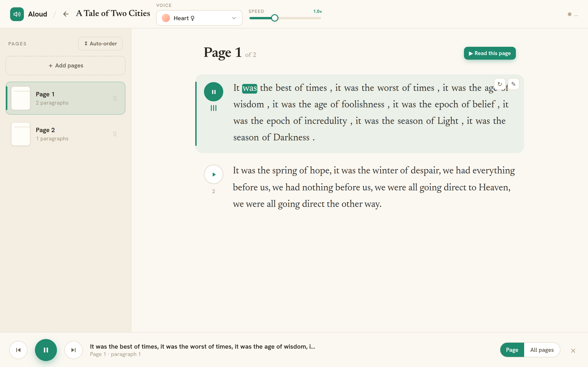
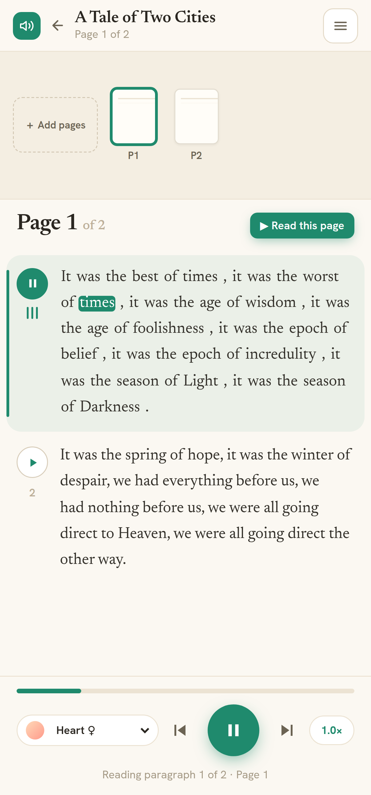

# Aloud — read your books out loud

**Aloud** turns photos of book pages into a warm, hands-free read-along
experience. Snap pictures of the pages (or paste raw text), and Aloud uses
**Google Gemini** to OCR them into clean, ordered **pages and paragraphs**,
then generates natural speech with **Kokoro TTS** and highlights each word as
it's spoken — karaoke style.

It's a single self-contained Go binary (SQLite + embedded vanilla-JS UI, no
build step) that proxies OCR to Gemini and synthesis to a self-hosted,
OpenAI-compatible Kokoro endpoint.



<p align="center">
  
</p>

## What it does

- **Projects** — group a book (or any document) into one place.
- **Photograph a book** — upload multiple page photos at once, in any order, or
  paste plain text.
- **Gemini OCR** — each image is transcribed verbatim into paragraphs, chapter
  titles preserved, running headers/footers dropped.
- **Smart page ordering** — pages are auto-ordered by detected page number; when
  numbers are missing, Gemini reorders them by narrative continuity. You can also
  drag to reorder manually.
- **Read-along karaoke** — click a paragraph (or "play page") and listen while
  the current word lights up, synced from Kokoro's word timestamps.
- **Seamless cross-page flow** — when a paragraph runs across a page break, Aloud
  detects the continuation and synthesizes it as one clip, so there's no pause
  mid-sentence.
- **Natural emphasis** — ALL-CAPS emphasis words are read naturally instead of
  being spelled out letter by letter.
- **Edit & regenerate** — fix an OCR slip or re-synthesize a phrase on demand.
- **Remembers where you were** — the current page is restored on refresh.
- **Desktop + mobile** — a warm editorial desktop layout and a dedicated mobile
  bottom-player with voice/speed pills and a hamburger menu.

```
browser ──► Aloud (Go, :8090) ──► Gemini  (OCR: page photos → text)
                              └──► Kokoro (TTS: text → audio + word timestamps)
```

## Quick start

Aloud needs a **Google Gemini API key** (for OCR) and a reachable **Kokoro**
endpoint (for speech).

**1. Configure secrets** — copy the example and fill in your key:

```bash
cp .env.example .env
# edit .env:
#   GEMINI_API_KEY=your-key-from-https://aistudio.google.com/apikey
#   KOKORO_BASE_URL=http://<your-kokoro-host>:8880/v1
```

> `.env` is gitignored — your key never gets committed.

**2. Run it in Docker:**

```bash
docker compose up --build -d
```

Open **http://localhost:8090**. Create a project, upload some page photos, and
watch them turn into a read-along book. Data (database, uploaded images, cached
audio) lives in the `invtts-data` Docker volume and survives rebuilds.

**Or run it locally** (Go 1.25+):

```bash
GEMINI_API_KEY=... KOKORO_BASE_URL=http://<host>:8880/v1 go run .
```

## Configuration

All set via environment variables (see `.env.example`):

| Variable          | Default               | Description                                   |
|-------------------|-----------------------|-----------------------------------------------|
| `GEMINI_API_KEY`  | _(required for OCR)_  | Google Gemini API key used to OCR page photos |
| `GEMINI_MODEL`    | `gemini-3.5-flash`    | Gemini model used for OCR + page ordering     |
| `KOKORO_BASE_URL` | `http://alpha-old:8880/v1` | OpenAI-compatible Kokoro base URL        |
| `KOKORO_API_KEY`  | `not-needed`          | Bearer token sent upstream to Kokoro          |
| `KOKORO_MODEL`    | `kokoro`              | Model name passed upstream                    |
| `DATA_DIR`        | `/data`               | Where the DB, images, and audio cache live    |
| `PORT`            | `8080`                | Port inside the container (host maps to 8090) |

## How it works

- **Persistence** — SQLite (`modernc.org/sqlite`, pure Go, `CGO_ENABLED=0`) with
  additive migrations. Schema: `projects → pages → paragraphs`.
- **OCR** (`ocr.go`) — Gemini `generateContent` with a JSON response schema:
  `{page_number, continues_previous_page, paragraphs[]}`.
- **Ordering** (`order.go`) — numeric when all pages are numbered, else Gemini
  orders by content flow.
- **TTS** (`kokoro.go`) — Kokoro `/dev/captioned_speech` returns base64 audio +
  `{word, start_time, end_time}` timestamps that drive the karaoke highlight.
- **Audio cache** — content-addressed by `sha256(text|voice|speed|format)`, so
  identical synth requests are served from disk.
- **Frontend** (`web/`) — a hash-routed vanilla-JS SPA embedded via `//go:embed`,
  with prefetch/look-ahead so the next paragraph is ready before you need it.

## Project layout

```
main.go          HTTP server, config, routing, embedded web/
store.go         SQLite store + migrations + CRUD
ocr.go           Gemini OCR (page photo → paragraphs)
order.go         Page ordering (numeric + AI content-flow)
kokoro.go        Kokoro captioned-speech client
text.go          Speech normalization (emphasis handling)
projects.go      Project/page/paragraph + speech HTTP handlers
voices.go        Kokoro voice catalogue + validation
web/             Embedded SPA (index.html, app.js, styles.css)
docs/img/        Screenshots
Dockerfile       Multi-stage build (golang:1.25-alpine, CGO off)
docker-compose.yml  Container + invtts-data volume, host :8090
macos/           Native SwiftUI app (earlier standalone TTS client)
```

## API

- `GET /api/projects` · `POST /api/projects` · `GET /api/projects/{id}` · `DELETE /api/projects/{id}`
- `POST /api/projects/{id}/pages` — multipart image(s) or `text`; OCRs async.
- `POST /api/projects/{id}/reorder` · `POST /api/projects/{id}/autoorder`
- `PUT /api/paragraphs/{id}` — edit text (clears cached audio).
- `POST /api/paragraphs/{id}/speech` — lazy synth, returns audio URL + timestamps.
- `POST /api/speak` — synth arbitrary combined text (used for cross-page flow).
- `GET /api/audio/{file}` · `GET /api/pages/{id}/image`
- `GET /api/health` · `GET /api/voices`
